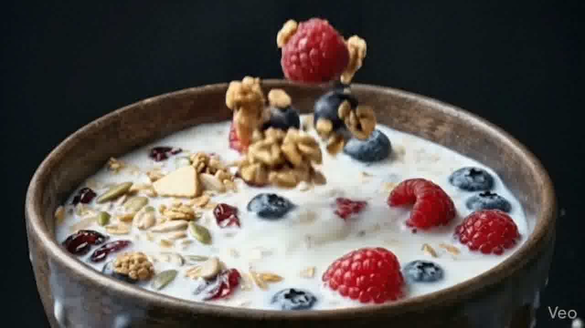

<a id="readme-top"></a>

<!-- PROJECT HEADER -->
<div align="center">
  

  <h3 align="center">Antigravity Nutrition landing page</h3>

  <p align="center">
    A breathtaking, high-performance web experience for luxury nutrition.
    <br />
    <strong><a href="https://github.com/Srijan339/stitch-plus-antigravity">Explore the docs »</a></strong>
    <br />
    <br />
    <a href="https://framer-animation-bowl.netlify.app/">View Live Demo</a>
    ·
    <a href="https://github.com/Srijan339/stitch-plus-antigravity/issues">Report Bug</a>
    ·
    <a href="https://github.com/Srijan339/stitch-plus-antigravity/issues">Request Feature</a>
  </p>
</div>

<!-- BADGES -->
<div align="center">
  
  
  
  
</div>

<br />

<!-- ABOUT THE PROJECT -->
## About The Project

This is a premium, single-page Next.js web application designed for an artisan nutrition brand. The core philosophy centers around an **"Antigravity"** aesthetic—showcasing physics-defying 3D assets mapped smoothly to user scrolling. 

It was built utilizing a highly optimized `<canvas>` sequence and `framer-motion` to create an Apple-style scrolling animation where the user's scroll directly drives the passage of time.

### 🎨 Asset Showcase

All high-fidelity floating assets were rendered natively onto a true `#000000` background. By taking advantage of CSS screen blending, they behave identically to transparent PNGs while running lighter.

<div align="left">
  
  
  
</div>

<p align="right">(<a href="#readme-top">back to top</a>)</p>

---

<!-- GETTING STARTED -->
## Getting Started

To get a local copy up and running, follow these simple steps.

### Prerequisites

You will need the latest LTS version of Node.js installed.
* npm
  ```sh
  npm install npm@latest -g
  ```

### Installation

1. Clone the repo
   ```sh
   git clone https://github.com/Srijan339/stitch-plus-antigravity.git
   ```
2. Navigate into the frontend folder
   ```sh
   cd frontend
   ```
3. Install NPM packages
   ```sh
   npm install
   ```
4. Start the Development Server
   ```sh
   npm run dev
   ```

<p align="right">(<a href="#readme-top">back to top</a>)</p>

---

<!-- DEPLOYMENT -->
## Netlify Deployment

This repository is pre-configured with a `netlify.toml` file to ensure **Zero-Config Deployment** on Netlify. 

1. Push this repository to GitHub.
2. Sign in to your [Netlify Dashboard](https://app.netlify.com).
3. Click `Add new site` > `Import an existing project`.
4. Connect to GitHub and select this repository.
5. Hit **Deploy Site**. Netlify will automatically detect Next.js App Router and deploy your site securely in under 2 minutes.

<p align="right">(<a href="#readme-top">back to top</a>)</p>

---

<!-- LICENSE -->
## License

Distributed under the MIT License. See `LICENSE.txt` for more information.

<p align="right">(<a href="#readme-top">back to top</a>)</p>
